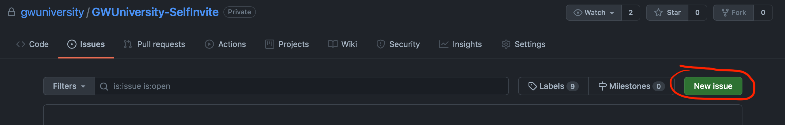
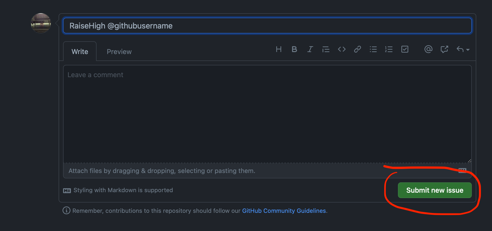

# Self Invitations to GWU's Github Organization

GWU is using Microsoft's Github Enterprise for Education. This product uses single sign-on and is available to current students, faculty, and staff. 

To use this service, you must be invited to the 'GWUniversity' github organization. Creating a new issue in this repository will allow you to invite yourself to this organization. Once a member, you can make use of the service as described here: https://github.com/gwuniversity/support-and-training.git

##### [How To Self Invite]
- Navigate to the issues section of this repository https://github.com/gwuniversity/GWUniversity-SelfInvite/issues or click above 
  
- Create a New Issue
  
- The ISSUE MUST BE Titled: RAISEHIGH @githubusername OR RAISEHIGH me
- Submit the issue
  
  
- Once the invitation is received and accepted, please return to the repo and close the issue.

##### [Notice:] 
The code and actions used in this repository are modified from the original project by Max Base. 
<pre>
Max Base
2021-06-19
https://github.com/BaseMax/AutoInviteToOrgByIssueComment
</pre>